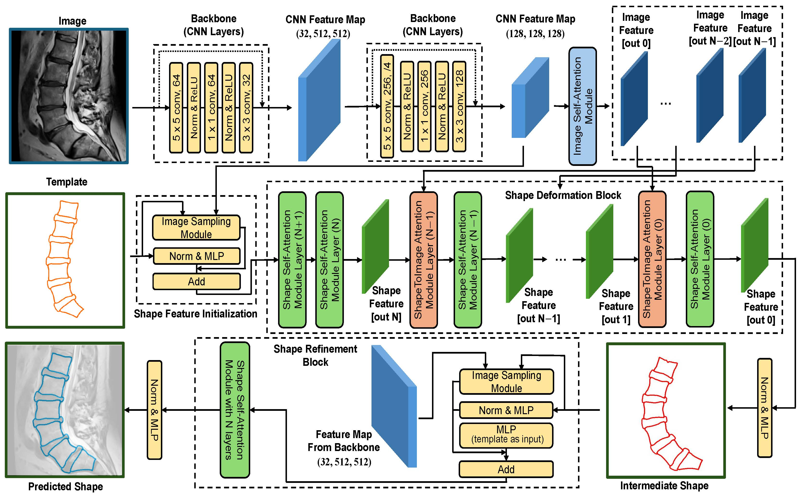
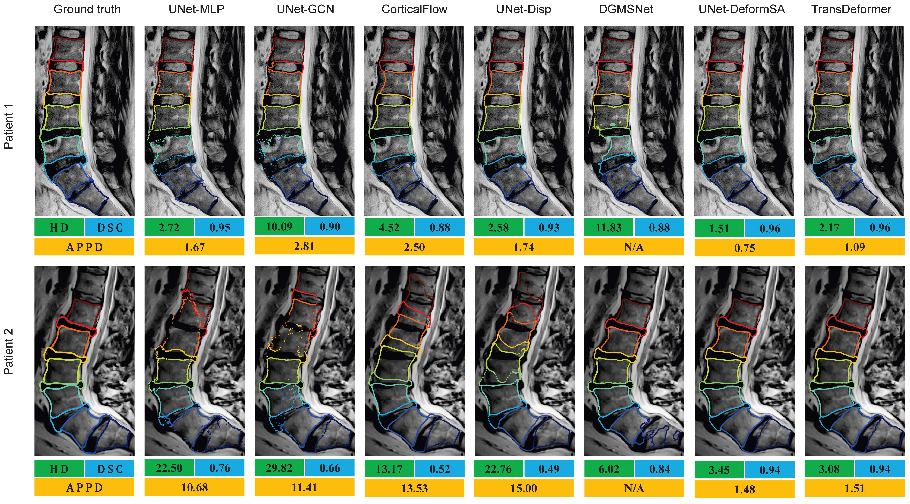

# TransDeformer-Mesh

</img>

This is the source code repository for our paper [**Attention-based Shape-Deformation Networks for Artifact-Free Geometry Reconstruction of Lumbar Spine from MR Images**](https://arxiv.org/abs/2404.00231). Here, we propose [**TransDeformer**](https://github.com/linchenq/TransDeformer-Mesh/blob/main/models/transDeformer.py), a novel attention-based deep learning approach that reconstructs the geometry of the lumbar spine with high spatial accuracy and mesh correspondence across patients. Also, [**UNet-DeformSA**](https://github.com/linchenq/TransDeformer-Mesh/blob/main/models/uNetDeformSA.py) is presented for geometry reconstruction and a variant of TransDeformer, named [**ShapeErrorEstimation**](https://github.com/linchenq/TransDeformer-Mesh/blob/main/models/ShapeErrorEst.py), is presented for error estimation.

## Abstract

Lumbar disc degeneration, a progressive structural wear and tear of lumbar intervertebral disc, is regarded as an essential role on low back pain, a significant global health concern. Automated lumbar spine geometry reconstruction from MR images will enable fast measurement of medical parameters to evaluate the lumbar status, in order to determine a suitable treatment. Existing image segmentation-based techniques often generate erroneous segments or unstructured point clouds, unsuitable for medical parameter measurement. In this work, we present TransDeformer: a novel attention-based deep learning approach that reconstructs the geometry of the lumbar spine with high spatial accuracy and mesh correspondence across patients, and we also present a variant of TransDeformer for error estimation. Specially, we devise new attention modules with a new attention formula, which integrate image features and tokenized contour features to predict the displacements of the points on a shape template without the need for image segmentation. The deformed template reveals the lumbar spine geometry in an image. Experiment results show that our TransDeformer generates artifact-free geometry outputs, and its variant predicts the error of a reconstructed geometry.

# Environment Setup
We recommend seting up an environment with `python>=3.10` and `pytorch>=2.0.0`. Especially for pytorch installation, please follow the command in this [website](https://pytorch.org/get-started/previous-versions/) and select proper version with your Computing platform (CUDA, CPU, etc.). Below is our command to install the pytorch dependencies with CUDA 11.7.
```
pip install torch==2.0.0 torchvision==0.15.1 torchaudio==2.0.1
```
After that, please execute the provided command to install the necessary dependencies.
```
pip install -r requirements.txt
```

## Toy Dataset and Evaluation

We present a toy dataset and related jupyter notebook to show the details of the evaluation. Google Colab is supported to run this notebook.

## Sample Results

</img>

## Citation
```
@misc{qian2024attentionbased,
      title={Attention-based Shape-Deformation Networks for Artifact-Free Geometry Reconstruction of Lumbar Spine from MR Images}, 
      author={Linchen Qian and Jiasong Chen and Linhai Ma and Timur Urakov and Weiyong Gu and Liang Liang},
      year={2024},
      eprint={2404.00231},
      archivePrefix={arXiv},
      primaryClass={cs.CV}
}
```


