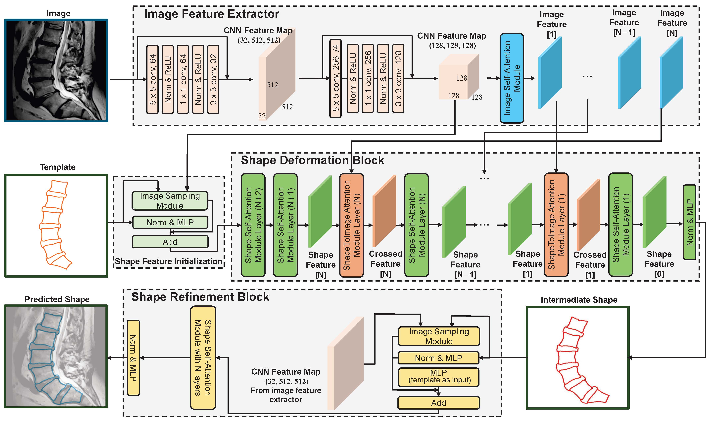
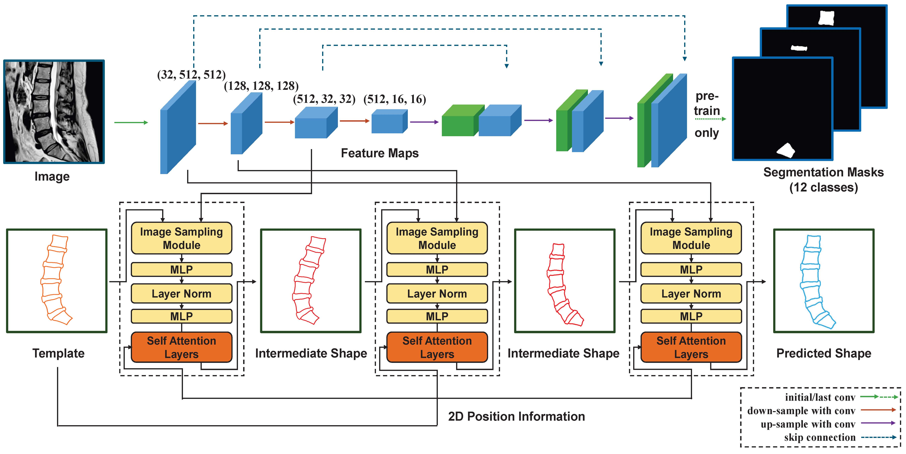

# TransDeformer-Mesh

<p align="center">
    </img>
    <p><b>Figure 1:</b> The architecture of our proposed model TransDeformer.</p>
</p>

This is the source code repository for our paper [**Attention-based Shape-Deformation Networks for Artifact-Free Geometry Reconstruction of Lumbar Spine from MR Images**](https://ieeexplore.ieee.org/document/11080083). Here, we propose [**TransDeformer**](https://github.com/linchenq/TransDeformer-Mesh/blob/main/models/transDeformer.py), a novel attention-based deep learning approach that reconstructs the geometry of the lumbar spine with high spatial accuracy and mesh correspondence across patients, as shown in the above Figure 1. Also, [**UNet-DeformSA**](https://github.com/linchenq/TransDeformer-Mesh/blob/main/models/uNetDeformSA.py) is presented for geometry reconstruction and a variant of TransDeformer, named [**ShapeErrorEstimation**](https://github.com/linchenq/TransDeformer-Mesh/blob/main/models/shapeErrorEst.py), is presented for error estimation, as shown in the below Figure 2. The paper is accepted and in early access stage by **IEEE Transactions on Medical Imaging**.

<p align="center">
    </img>
    <p><b>Figure 2:</b> The architecture of our proposed model UNet-DeformSA.</p>
</p>

## Abstract

Lumbar disc degeneration, a progressive structural wear and tear of lumbar intervertebral disc, is regarded as an essential role on low back pain, a significant global health concern. Automated lumbar spine geometry reconstruction from MR images will enable fast measurement of medical parameters to evaluate the lumbar status, in order to determine a suitable treatment. Existing image segmentation-based techniques often generate erroneous segments or unstructured point clouds, unsuitable for medical parameter measurement. In this work, we present UNet-DeformSA and TransDeformer: novel attention-based deep neural networks that reconstruct the geometry of the lumbar spine with high spatial accuracy and mesh correspondence across patients, and we also present a variant of TransDeformer for error estimation. Specially, we devise new attention modules with a new attention formula, which integrate tokenized image features and tokenized shape features to predict the displacements of the points on a shape template. The deformed template reveals the lumbar spine geometry in an image. Experiment results show that our networks generate artifact-free geometry outputs, and the variant of TransDeformer can predict the errors of a reconstructed geometry.

# Environment Setup
We recommend seting up an environment with `python>=3.10` and `pytorch>=2.0.0`. Especially for pytorch installation, please follow the command in this [website](https://pytorch.org/get-started/previous-versions/) and select proper version with your Computing platform (CUDA, CPU, etc.). Below is our command to install the pytorch dependencies with CUDA 11.7.
```
pip install torch==2.0.0 torchvision==0.15.1 torchaudio==2.0.1
```
After that, please execute the provided command to install the necessary dependencies.
```
pip install -r requirements.txt
```

## Toy Dataset and Evaluation

We present a toy dataset and related jupyter notebook to show the details of the evaluation.  
Google Colab is supported to run this notebook. Considering the computing platform, we initialize the ```device``` in Section `Common preparation` but don't apply our inference process (including models and toy dataset) on any GPU or TPU. It's easier to re-run this [Colab Notebook Version](https://colab.research.google.com/github/linchenq/TransDeformer-Mesh/blob/main/infer_toy_colab.ipynb). This Colab allows you to edit the files from the repository directly in the Colab UI and annotates Colab cells that walk you through the code step by step. Below is the link for better visualization.

https://colab.research.google.com/github/linchenq/TransDeformer-Mesh/blob/main/infer_toy_colab.ipynb

## Explanation on Data Annotation
We upload the tutorial for lumbar spine geometry initial annotation by 3D Slicer [Data Annotation Tutorial Video]([https://www.youtube.com/watch?v=GIA2YJbujxo](https://youtu.be/zBNA0Mgzhys))

## Dataset Link
* [SSMSpine Dataset](https://github.com/jiasongchen/SSMSpine)
* [MRSpineSeg](https://github.com/pangshumao/SpineParseNet) and [MRSpineSeg Additional](https://github.com/pangshumao/DGMSNet)

## Sample Results

<p align="center">
    </img>
</p>

## Citation
```
@article{11080083,
         author={Qian, Linchen and Chen, Jiasong and Ma, Linhai and Urakov, Timur and Gu, Weiyong and Liang, Liang},
         journal={IEEE Transactions on Medical Imaging}, 
         title={Attention-based Shape-Deformation Networks for Artifact-Free Geometry Reconstruction of Lumbar Spine from MR Images}, 
         year={2025},
         pages={1-1},
         keywords={Geometry;Spine;Image segmentation;Image reconstruction;Shape;Mathematical models;Deformable models;Deep learning;Deformation;Computed tomography;deep learning;geometry reconstruction;lumbar spine;mesh correspondence;attention},
         doi={10.1109/TMI.2025.3588831}}
```


